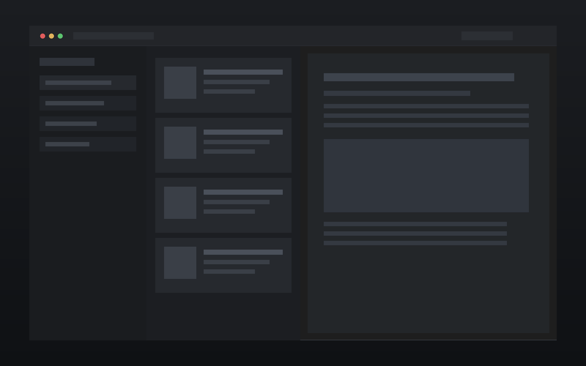

# Krss

[](https://www.gnu.org/licenses/old-licenses/gpl-2.0.en.html)
[](https://github.com/hu2327401139/krss/actions/workflows/docker-build.yml)

轻量级自托管 RSS 阅读器：单二进制 + SQLite，三栏界面，内置 AI 摘要与翻译、自动化过滤规则。



## 功能特性

### 订阅与阅读

- 支持 RSS 2.0 / Atom / JSON Feed
- OPML 导入与导出（导入带进度、可取消）
- 文件夹分层管理、拖拽排序；订阅可设置内容类型与图标
- 未读 / 星标视图，未读角标可自定义，全文搜索
- 阅读模式（自动提取正文），图集灯箱，图片代理（解决防盗链）
- 站点反爬（Anubis 类）Cookie 配置

### AI 能力（自备 API Key）

- 文章摘要、单篇翻译与批量翻译
- 支持 OpenAI、Anthropic 及兼容接口，可拉取模型列表并测试连通

### 自动化

- 过滤规则：按标题 / 正文 / 作者的关键词或正则匹配，也可用自然语言生成规则
- 规则动作：星标、打标签、静音、删除、通知；支持预览命中与按规则撤销
- 定时刷新（间隔可配）、手动刷新与刷新报告
- 通知：webhook 推送 + 应用内通知时间线

### 集成

- 内置 MCP 服务端：外部 AI 客户端可直接读取条目
- 可把外部 MCP 服务器作为订阅源接入
- RSSHub 地址与 Access Key 配置
- 代理：按订阅 / 文件夹设置，密码字段掩码显示

### 界面

- 三栏布局（订阅 / 列表 / 正文），卡片列表 + 浮层阅读面板
- 5 套主题（3 浅 2 深）与跟随系统；主题色、圆角、列表密度、正文字体 / 字号 / 行高可调
- 键盘快捷键：`j` `k` 上下条、`m` 未读、`s` 星标、`v` 原文、`g` 阅读模式、`r` 刷新、`?` 帮助
- PWA，可安装到桌面与移动设备
- 界面语言：简体中文 / English

## 部署

### Docker Compose（推荐）

```bash
curl -O https://raw.githubusercontent.com/hu2327401139/krss/main/docker-compose.yml
docker compose up -d
```

或手动创建 `docker-compose.yml`：

```yaml
services:
  krss:
    image: ghcr.io/hu2327401139/krss:latest
    container_name: krss
    ports:
      - "8080:8080"
    volumes:
      - ./data:/app/data
    environment:
      - KRSS_LOG_LEVEL=info
    restart: always
```

访问 `http://localhost:8080`，首次打开会引导创建账号；数据持久化在 `./data` 目录。

### Docker Run

```bash
docker run -d \
  --name krss \
  -p 8080:8080 \
  -v ./data:/app/data \
  ghcr.io/hu2327401139/krss:latest
```

### 环境变量

| 变量                | 默认值           | 说明                                          |
| ------------------- | ---------------- | --------------------------------------------- |
| `KRSS_ADDR`         | `:8080`          | 监听地址                                      |
| `KRSS_DATA_DIR`     | `./data`         | 数据目录（容器内为 `/app/data`）              |
| `KRSS_DB_PATH`      | `data/krss.db`   | SQLite 数据库文件路径                         |
| `KRSS_STATIC_DIR`   | 自动探测         | 前端静态文件目录（`frontend/dist`）           |
| `KRSS_LOG_LEVEL`    | `info`           | 日志级别：`debug` / `info` / `warn` / `error` |
| `KRSS_SWAGGER`      | `false`          | 设为 `true` 开启 `/swagger/index.html`        |
| `KRSS_ENABLE_PPROF` | `false`          | 开启 pprof 性能分析                           |
| `KRSS_PPROF_ADDR`   | `127.0.0.1:6060` | pprof 监听地址（开启后生效）                  |

## 本地开发

### 前置依赖

- Go 1.25+
- [Bun](https://bun.sh/)

### 后端

```bash
cd backend
go mod download
go run ./cmd/server        # 默认 http://localhost:8080，数据落在 ./data
```

### 前端

```bash
cd frontend
bun install
bun run dev                # http://localhost:5173，默认代理到 :8080
```

后端不在默认端口时用 `KRSS_DEV_BACKEND` 指定：

```bash
KRSS_DEV_BACKEND=http://localhost:8082 bun run dev
```

### 测试与质量门

```bash
# 后端
cd backend
make test                  # go test ./... -race
make lint                  # golangci-lint run

# 前端
cd frontend
bun run test               # vitest run
bunx tsc -b                # 类型检查
bun run build              # 产物输出到 dist/
```

## 目录结构

```
backend/            Go 后端：API、SQLite、抓取与解析、规则引擎、MCP
frontend/           React + Vite 前端
docker/             Dockerfile 与 entrypoint
.github/workflows/  CI：后端测试、前端测试、镜像构建、发布
docker-compose.yml  一键部署
```

## 致谢

- 本项目基于 [Gist](https://github.com/9bingyin/Gist) 改造
- [Nextflux](https://github.com/electh/nextflux)
- [Folo](https://github.com/RSSNext/Folo)

## 许可证

[GPL-2.0](./LICENSE)
